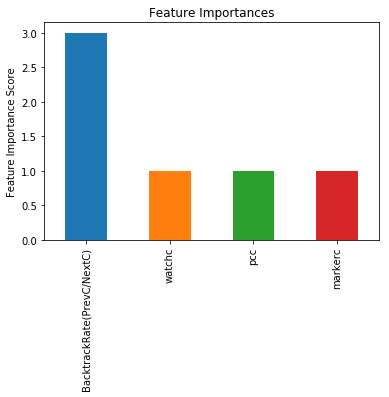

```python
!pip3 install matplotlib
```

    Requirement already satisfied (use --upgrade to upgrade): matplotlib in /usr/local/lib/python3.5/dist-packages
    Requirement already satisfied (use --upgrade to upgrade): cycler>=0.10 in /usr/local/lib/python3.5/dist-packages (from matplotlib)
    Requirement already satisfied (use --upgrade to upgrade): pyparsing!=2.0.4,!=2.1.2,!=2.1.6,>=2.0.1 in /usr/local/lib/python3.5/dist-packages (from matplotlib)
    Requirement already satisfied (use --upgrade to upgrade): numpy>=1.7.1 in /usr/local/lib/python3.5/dist-packages (from matplotlib)
    Requirement already satisfied (use --upgrade to upgrade): pytz in /usr/local/lib/python3.5/dist-packages (from matplotlib)
    Requirement already satisfied (use --upgrade to upgrade): six>=1.10 in /usr/lib/python3/dist-packages (from matplotlib)
    Requirement already satisfied (use --upgrade to upgrade): kiwisolver>=1.0.1 in /usr/local/lib/python3.5/dist-packages (from matplotlib)
    Requirement already satisfied (use --upgrade to upgrade): python-dateutil>=2.1 in /usr/local/lib/python3.5/dist-packages (from matplotlib)
    Requirement already satisfied (use --upgrade to upgrade): setuptools in /usr/lib/python3/dist-packages (from kiwisolver>=1.0.1->matplotlib)
    You are using pip version 8.1.1, however version 18.0 is available.
    You should consider upgrading via the 'pip install --upgrade pip' command.


```python
import pandas as pd
import numpy as np
import xgboost as xgb
from xgboost.sklearn import XGBClassifier
from sklearn import cross_validation, metrics   #Additional scklearn functions
from sklearn.grid_search import GridSearchCV   #Perforing grid search

import matplotlib.pylab as plt
%matplotlib inline
from matplotlib.pylab import rcParams
rcParams['figure.figsize'] = 12, 4
```

    /usr/local/lib/python3.5/dist-packages/sklearn/cross_validation.py:41: DeprecationWarning: This module was deprecated in version 0.18 in favor of the model_selection module into which all the refactored classes and functions are moved. Also note that the interface of the new CV iterators are different from that of this module. This module will be removed in 0.20.
      "This module will be removed in 0.20.", DeprecationWarning)
    /usr/local/lib/python3.5/dist-packages/sklearn/grid_search.py:42: DeprecationWarning: This module was deprecated in version 0.18 in favor of the model_selection module into which all the refactored classes and functions are moved. This module will be removed in 0.20.
      DeprecationWarning)


```python
train = pd.read_csv('Train_nyOWmfK.csv', encoding='latin_1')
train = train.drop(['City', 'DOB', 'EMI_Loan_Submitted', 'Employer_Name', 'Interest_Rate'], axis=1)
train = train.drop(['Lead_Creation_Date', 'LoggedIn', 'Salary_Account', 'Var1', 'Filled_Form'], axis=1)
train = train.drop(['Device_Type', 'Var2', 'Mobile_Verified', 'Source', 'Gender'], axis=1)
train = train.fillna(1)
target = 'Disbursed'
IDcol = 'ID'
train.head(5)
```


<div>
<style scoped>
    .dataframe tbody tr th:only-of-type {
        vertical-align: middle;
    }

    .dataframe tbody tr th {
        vertical-align: top;
    }

    .dataframe thead th {
        text-align: right;
    }
</style>
<table border="1" class="dataframe">
  <thead>
    <tr style="text-align: right;">
      <th></th>
      <th>ID</th>
      <th>Monthly_Income</th>
      <th>Loan_Amount_Applied</th>
      <th>Loan_Tenure_Applied</th>
      <th>Existing_EMI</th>
      <th>Var5</th>
      <th>Loan_Amount_Submitted</th>
      <th>Loan_Tenure_Submitted</th>
      <th>Processing_Fee</th>
      <th>Var4</th>
      <th>Disbursed</th>
    </tr>
  </thead>
  <tbody>
    <tr>
      <th>0</th>
      <td>ID000002C20</td>
      <td>20000</td>
      <td>300000.0</td>
      <td>5.0</td>
      <td>0.0</td>
      <td>0</td>
      <td>1.0</td>
      <td>1.0</td>
      <td>1.0</td>
      <td>1</td>
      <td>0</td>
    </tr>
    <tr>
      <th>1</th>
      <td>ID000004E40</td>
      <td>35000</td>
      <td>200000.0</td>
      <td>2.0</td>
      <td>0.0</td>
      <td>13</td>
      <td>200000.0</td>
      <td>2.0</td>
      <td>1.0</td>
      <td>3</td>
      <td>0</td>
    </tr>
    <tr>
      <th>2</th>
      <td>ID000007H20</td>
      <td>22500</td>
      <td>600000.0</td>
      <td>4.0</td>
      <td>0.0</td>
      <td>0</td>
      <td>450000.0</td>
      <td>4.0</td>
      <td>1.0</td>
      <td>1</td>
      <td>0</td>
    </tr>
    <tr>
      <th>3</th>
      <td>ID000008I30</td>
      <td>35000</td>
      <td>1000000.0</td>
      <td>5.0</td>
      <td>0.0</td>
      <td>10</td>
      <td>920000.0</td>
      <td>5.0</td>
      <td>1.0</td>
      <td>3</td>
      <td>0</td>
    </tr>
    <tr>
      <th>4</th>
      <td>ID000009J40</td>
      <td>100000</td>
      <td>500000.0</td>
      <td>2.0</td>
      <td>25000.0</td>
      <td>17</td>
      <td>500000.0</td>
      <td>2.0</td>
      <td>1.0</td>
      <td>3</td>
      <td>0</td>
    </tr>
  </tbody>
</table>
</div>


```python
def modelfit(alg, dtrain, predictors,useTrainCV=True, cv_folds=5, early_stopping_rounds=50):
    
    if useTrainCV:
        xgb_param = alg.get_xgb_params()
        xgtrain = xgb.DMatrix(dtrain[predictors].values, label=dtrain[target].values)
        cvresult = xgb.cv(xgb_param, xgtrain, num_boost_round=alg.get_params()['n_estimators'], nfold=cv_folds,
            metrics='auc', early_stopping_rounds=early_stopping_rounds)
        alg.set_params(n_estimators=cvresult.shape[0])
    
    #Fit the algorithm on the data
    alg.fit(dtrain[predictors], dtrain['Disbursed'],eval_metric='auc')
        
    #Predict training set:
    dtrain_predictions = alg.predict(dtrain[predictors])
    dtrain_predprob = alg.predict_proba(dtrain[predictors])[:,1]
        
    #Print model report:
    print ("\nModel Report")
    print ("Accuracy : %.4g" % metrics.accuracy_score(dtrain['Disbursed'].values, dtrain_predictions))
    print ("AUC Score (Train): %f" % metrics.roc_auc_score(dtrain['Disbursed'], dtrain_predprob))
     
        
    #print(alg.booster().get_fscore())
    feat_imp = pd.Series(alg.get_booster().get_score(importance_type='weight')).sort_values(ascending=False)
    #feat_imp = pd.Series(alg.booster().get_fscore()).sort_values(ascending=False)
    feat_imp.plot(kind='bar', title='Feature Importances')
    plt.ylabel('Feature Importance Score')
```


```python
xgb1 = XGBClassifier(
 learning_rate =0.1,
 n_estimators=1000,
 max_depth=5,
 min_child_weight=1,
 gamma=0,
 subsample=0.8,
 colsample_bytree=0.8,
 objective= 'binary:logistic',
 nthread=4,
 scale_pos_weight=1,
 seed=27)
```


```python

traink = pd.read_csv('kyoto_df_1.csv')
traink = traink.drop(['Unnamed: 0', 'userid'], axis=1)
traink.rename(index=str, columns={"class": "Disbursed"}, inplace=True)
predictors = list(traink)
traink
```


<div>
<style scoped>
    .dataframe tbody tr th:only-of-type {
        vertical-align: middle;
    }

    .dataframe tbody tr th {
        vertical-align: top;
    }

    .dataframe thead th {
        text-align: right;
    }
</style>
<table border="1" class="dataframe">
  <thead>
    <tr style="text-align: right;">
      <th></th>
      <th>bookmarkc</th>
      <th>closec</th>
      <th>markerc</th>
      <th>memoc</th>
      <th>mobilec</th>
      <th>openc</th>
      <th>pcc</th>
      <th>tabletc</th>
      <th>watchc</th>
      <th>SEARCH</th>
      <th>...</th>
      <th>Page_JumpC</th>
      <th>Add_BookmarkC</th>
      <th>Delete_BookmarkC</th>
      <th>Add_MemoC</th>
      <th>Delete_MemoC</th>
      <th>Change_MemoC</th>
      <th>Add_MarkerC</th>
      <th>Delete_MarkerC</th>
      <th>Readpages</th>
      <th>Disbursed</th>
    </tr>
  </thead>
  <tbody>
    <tr>
      <th>0</th>
      <td>0</td>
      <td>3</td>
      <td>0</td>
      <td>0</td>
      <td>0</td>
      <td>27</td>
      <td>1240</td>
      <td>66</td>
      <td>1306</td>
      <td>0</td>
      <td>...</td>
      <td>65</td>
      <td>0</td>
      <td>0</td>
      <td>0</td>
      <td>0</td>
      <td>0</td>
      <td>0</td>
      <td>0</td>
      <td>1211</td>
      <td>False</td>
    </tr>
    <tr>
      <th>1</th>
      <td>0</td>
      <td>0</td>
      <td>0</td>
      <td>0</td>
      <td>0</td>
      <td>1</td>
      <td>8</td>
      <td>0</td>
      <td>8</td>
      <td>0</td>
      <td>...</td>
      <td>0</td>
      <td>0</td>
      <td>0</td>
      <td>0</td>
      <td>0</td>
      <td>0</td>
      <td>0</td>
      <td>0</td>
      <td>7</td>
      <td>False</td>
    </tr>
    <tr>
      <th>2</th>
      <td>2</td>
      <td>1</td>
      <td>2</td>
      <td>0</td>
      <td>45</td>
      <td>5</td>
      <td>409</td>
      <td>0</td>
      <td>454</td>
      <td>0</td>
      <td>...</td>
      <td>1</td>
      <td>1</td>
      <td>1</td>
      <td>0</td>
      <td>0</td>
      <td>0</td>
      <td>2</td>
      <td>0</td>
      <td>443</td>
      <td>False</td>
    </tr>
    <tr>
      <th>3</th>
      <td>2</td>
      <td>0</td>
      <td>2</td>
      <td>2</td>
      <td>0</td>
      <td>4</td>
      <td>89</td>
      <td>0</td>
      <td>89</td>
      <td>0</td>
      <td>...</td>
      <td>2</td>
      <td>1</td>
      <td>1</td>
      <td>1</td>
      <td>0</td>
      <td>0</td>
      <td>1</td>
      <td>1</td>
      <td>77</td>
      <td>False</td>
    </tr>
    <tr>
      <th>4</th>
      <td>0</td>
      <td>3</td>
      <td>0</td>
      <td>0</td>
      <td>0</td>
      <td>5</td>
      <td>540</td>
      <td>0</td>
      <td>540</td>
      <td>0</td>
      <td>...</td>
      <td>2</td>
      <td>0</td>
      <td>0</td>
      <td>0</td>
      <td>0</td>
      <td>0</td>
      <td>0</td>
      <td>0</td>
      <td>530</td>
      <td>True</td>
    </tr>
    <tr>
      <th>5</th>
      <td>0</td>
      <td>0</td>
      <td>0</td>
      <td>0</td>
      <td>0</td>
      <td>2</td>
      <td>267</td>
      <td>0</td>
      <td>267</td>
      <td>9</td>
      <td>...</td>
      <td>2</td>
      <td>0</td>
      <td>0</td>
      <td>0</td>
      <td>0</td>
      <td>0</td>
      <td>0</td>
      <td>0</td>
      <td>253</td>
      <td>True</td>
    </tr>
    <tr>
      <th>6</th>
      <td>0</td>
      <td>3</td>
      <td>0</td>
      <td>0</td>
      <td>379</td>
      <td>6</td>
      <td>239</td>
      <td>0</td>
      <td>618</td>
      <td>0</td>
      <td>...</td>
      <td>0</td>
      <td>0</td>
      <td>0</td>
      <td>0</td>
      <td>0</td>
      <td>0</td>
      <td>0</td>
      <td>0</td>
      <td>609</td>
      <td>True</td>
    </tr>
    <tr>
      <th>7</th>
      <td>0</td>
      <td>0</td>
      <td>0</td>
      <td>0</td>
      <td>0</td>
      <td>8</td>
      <td>0</td>
      <td>1950</td>
      <td>1950</td>
      <td>0</td>
      <td>...</td>
      <td>0</td>
      <td>0</td>
      <td>0</td>
      <td>0</td>
      <td>0</td>
      <td>0</td>
      <td>0</td>
      <td>0</td>
      <td>1942</td>
      <td>True</td>
    </tr>
    <tr>
      <th>8</th>
      <td>0</td>
      <td>3</td>
      <td>0</td>
      <td>0</td>
      <td>0</td>
      <td>10</td>
      <td>362</td>
      <td>0</td>
      <td>362</td>
      <td>0</td>
      <td>...</td>
      <td>4</td>
      <td>0</td>
      <td>0</td>
      <td>0</td>
      <td>0</td>
      <td>0</td>
      <td>0</td>
      <td>0</td>
      <td>344</td>
      <td>False</td>
    </tr>
    <tr>
      <th>9</th>
      <td>0</td>
      <td>6</td>
      <td>0</td>
      <td>0</td>
      <td>0</td>
      <td>10</td>
      <td>863</td>
      <td>0</td>
      <td>863</td>
      <td>0</td>
      <td>...</td>
      <td>2</td>
      <td>0</td>
      <td>0</td>
      <td>0</td>
      <td>0</td>
      <td>0</td>
      <td>0</td>
      <td>0</td>
      <td>845</td>
      <td>False</td>
    </tr>
    <tr>
      <th>10</th>
      <td>0</td>
      <td>5</td>
      <td>1</td>
      <td>0</td>
      <td>0</td>
      <td>12</td>
      <td>1334</td>
      <td>0</td>
      <td>1334</td>
      <td>2</td>
      <td>...</td>
      <td>6</td>
      <td>0</td>
      <td>0</td>
      <td>0</td>
      <td>0</td>
      <td>0</td>
      <td>1</td>
      <td>0</td>
      <td>1306</td>
      <td>False</td>
    </tr>
    <tr>
      <th>11</th>
      <td>0</td>
      <td>2</td>
      <td>2</td>
      <td>3</td>
      <td>0</td>
      <td>5</td>
      <td>377</td>
      <td>0</td>
      <td>377</td>
      <td>0</td>
      <td>...</td>
      <td>0</td>
      <td>0</td>
      <td>0</td>
      <td>1</td>
      <td>0</td>
      <td>1</td>
      <td>1</td>
      <td>1</td>
      <td>365</td>
      <td>True</td>
    </tr>
    <tr>
      <th>12</th>
      <td>2</td>
      <td>11</td>
      <td>2</td>
      <td>0</td>
      <td>25</td>
      <td>16</td>
      <td>1712</td>
      <td>0</td>
      <td>1737</td>
      <td>0</td>
      <td>...</td>
      <td>15</td>
      <td>1</td>
      <td>1</td>
      <td>0</td>
      <td>0</td>
      <td>0</td>
      <td>2</td>
      <td>0</td>
      <td>1689</td>
      <td>True</td>
    </tr>
    <tr>
      <th>13</th>
      <td>0</td>
      <td>3</td>
      <td>0</td>
      <td>0</td>
      <td>228</td>
      <td>13</td>
      <td>624</td>
      <td>0</td>
      <td>852</td>
      <td>0</td>
      <td>...</td>
      <td>8</td>
      <td>0</td>
      <td>0</td>
      <td>0</td>
      <td>0</td>
      <td>0</td>
      <td>0</td>
      <td>0</td>
      <td>828</td>
      <td>False</td>
    </tr>
    <tr>
      <th>14</th>
      <td>0</td>
      <td>0</td>
      <td>0</td>
      <td>0</td>
      <td>0</td>
      <td>1</td>
      <td>15</td>
      <td>0</td>
      <td>15</td>
      <td>0</td>
      <td>...</td>
      <td>1</td>
      <td>0</td>
      <td>0</td>
      <td>0</td>
      <td>0</td>
      <td>0</td>
      <td>0</td>
      <td>0</td>
      <td>13</td>
      <td>False</td>
    </tr>
    <tr>
      <th>15</th>
      <td>0</td>
      <td>9</td>
      <td>0</td>
      <td>0</td>
      <td>17</td>
      <td>14</td>
      <td>1210</td>
      <td>441</td>
      <td>1668</td>
      <td>2</td>
      <td>...</td>
      <td>6</td>
      <td>0</td>
      <td>0</td>
      <td>0</td>
      <td>0</td>
      <td>0</td>
      <td>0</td>
      <td>0</td>
      <td>1636</td>
      <td>True</td>
    </tr>
    <tr>
      <th>16</th>
      <td>0</td>
      <td>3</td>
      <td>0</td>
      <td>0</td>
      <td>2</td>
      <td>9</td>
      <td>582</td>
      <td>0</td>
      <td>584</td>
      <td>0</td>
      <td>...</td>
      <td>1</td>
      <td>0</td>
      <td>0</td>
      <td>0</td>
      <td>0</td>
      <td>0</td>
      <td>0</td>
      <td>0</td>
      <td>571</td>
      <td>True</td>
    </tr>
    <tr>
      <th>17</th>
      <td>0</td>
      <td>0</td>
      <td>0</td>
      <td>0</td>
      <td>207</td>
      <td>3</td>
      <td>0</td>
      <td>0</td>
      <td>207</td>
      <td>0</td>
      <td>...</td>
      <td>0</td>
      <td>0</td>
      <td>0</td>
      <td>0</td>
      <td>0</td>
      <td>0</td>
      <td>0</td>
      <td>0</td>
      <td>204</td>
      <td>True</td>
    </tr>
    <tr>
      <th>18</th>
      <td>0</td>
      <td>0</td>
      <td>0</td>
      <td>0</td>
      <td>9</td>
      <td>2</td>
      <td>0</td>
      <td>0</td>
      <td>9</td>
      <td>0</td>
      <td>...</td>
      <td>0</td>
      <td>0</td>
      <td>0</td>
      <td>0</td>
      <td>0</td>
      <td>0</td>
      <td>0</td>
      <td>0</td>
      <td>7</td>
      <td>False</td>
    </tr>
    <tr>
      <th>19</th>
      <td>0</td>
      <td>5</td>
      <td>0</td>
      <td>0</td>
      <td>0</td>
      <td>9</td>
      <td>900</td>
      <td>0</td>
      <td>900</td>
      <td>0</td>
      <td>...</td>
      <td>9</td>
      <td>0</td>
      <td>0</td>
      <td>0</td>
      <td>0</td>
      <td>0</td>
      <td>0</td>
      <td>0</td>
      <td>873</td>
      <td>True</td>
    </tr>
    <tr>
      <th>20</th>
      <td>0</td>
      <td>0</td>
      <td>0</td>
      <td>0</td>
      <td>0</td>
      <td>4</td>
      <td>0</td>
      <td>526</td>
      <td>526</td>
      <td>0</td>
      <td>...</td>
      <td>15</td>
      <td>0</td>
      <td>0</td>
      <td>0</td>
      <td>0</td>
      <td>0</td>
      <td>0</td>
      <td>0</td>
      <td>507</td>
      <td>False</td>
    </tr>
    <tr>
      <th>21</th>
      <td>0</td>
      <td>0</td>
      <td>0</td>
      <td>0</td>
      <td>116</td>
      <td>1</td>
      <td>0</td>
      <td>0</td>
      <td>116</td>
      <td>0</td>
      <td>...</td>
      <td>0</td>
      <td>0</td>
      <td>0</td>
      <td>0</td>
      <td>0</td>
      <td>0</td>
      <td>0</td>
      <td>0</td>
      <td>115</td>
      <td>False</td>
    </tr>
    <tr>
      <th>22</th>
      <td>2</td>
      <td>2</td>
      <td>2</td>
      <td>7</td>
      <td>0</td>
      <td>6</td>
      <td>160</td>
      <td>0</td>
      <td>160</td>
      <td>9</td>
      <td>...</td>
      <td>5</td>
      <td>1</td>
      <td>1</td>
      <td>5</td>
      <td>0</td>
      <td>1</td>
      <td>2</td>
      <td>0</td>
      <td>125</td>
      <td>False</td>
    </tr>
    <tr>
      <th>23</th>
      <td>0</td>
      <td>0</td>
      <td>0</td>
      <td>0</td>
      <td>0</td>
      <td>5</td>
      <td>710</td>
      <td>0</td>
      <td>710</td>
      <td>0</td>
      <td>...</td>
      <td>5</td>
      <td>0</td>
      <td>0</td>
      <td>0</td>
      <td>0</td>
      <td>0</td>
      <td>0</td>
      <td>0</td>
      <td>700</td>
      <td>True</td>
    </tr>
    <tr>
      <th>24</th>
      <td>0</td>
      <td>1</td>
      <td>0</td>
      <td>0</td>
      <td>150</td>
      <td>5</td>
      <td>547</td>
      <td>0</td>
      <td>697</td>
      <td>1</td>
      <td>...</td>
      <td>4</td>
      <td>0</td>
      <td>0</td>
      <td>0</td>
      <td>0</td>
      <td>0</td>
      <td>0</td>
      <td>0</td>
      <td>686</td>
      <td>False</td>
    </tr>
    <tr>
      <th>25</th>
      <td>0</td>
      <td>2</td>
      <td>0</td>
      <td>0</td>
      <td>0</td>
      <td>4</td>
      <td>0</td>
      <td>151</td>
      <td>151</td>
      <td>0</td>
      <td>...</td>
      <td>0</td>
      <td>0</td>
      <td>0</td>
      <td>0</td>
      <td>0</td>
      <td>0</td>
      <td>0</td>
      <td>0</td>
      <td>145</td>
      <td>False</td>
    </tr>
    <tr>
      <th>26</th>
      <td>4</td>
      <td>2</td>
      <td>3</td>
      <td>4</td>
      <td>0</td>
      <td>4</td>
      <td>341</td>
      <td>0</td>
      <td>341</td>
      <td>0</td>
      <td>...</td>
      <td>10</td>
      <td>2</td>
      <td>2</td>
      <td>3</td>
      <td>0</td>
      <td>0</td>
      <td>2</td>
      <td>1</td>
      <td>314</td>
      <td>False</td>
    </tr>
    <tr>
      <th>27</th>
      <td>0</td>
      <td>0</td>
      <td>0</td>
      <td>0</td>
      <td>0</td>
      <td>2</td>
      <td>57</td>
      <td>0</td>
      <td>57</td>
      <td>0</td>
      <td>...</td>
      <td>0</td>
      <td>0</td>
      <td>0</td>
      <td>0</td>
      <td>0</td>
      <td>0</td>
      <td>0</td>
      <td>0</td>
      <td>55</td>
      <td>True</td>
    </tr>
    <tr>
      <th>28</th>
      <td>0</td>
      <td>0</td>
      <td>0</td>
      <td>0</td>
      <td>0</td>
      <td>2</td>
      <td>423</td>
      <td>0</td>
      <td>423</td>
      <td>17</td>
      <td>...</td>
      <td>7</td>
      <td>0</td>
      <td>0</td>
      <td>0</td>
      <td>0</td>
      <td>0</td>
      <td>0</td>
      <td>0</td>
      <td>397</td>
      <td>True</td>
    </tr>
    <tr>
      <th>29</th>
      <td>0</td>
      <td>3</td>
      <td>0</td>
      <td>0</td>
      <td>0</td>
      <td>17</td>
      <td>1690</td>
      <td>0</td>
      <td>1690</td>
      <td>0</td>
      <td>...</td>
      <td>0</td>
      <td>0</td>
      <td>0</td>
      <td>0</td>
      <td>0</td>
      <td>0</td>
      <td>0</td>
      <td>0</td>
      <td>1670</td>
      <td>True</td>
    </tr>
    <tr>
      <th>30</th>
      <td>0</td>
      <td>0</td>
      <td>0</td>
      <td>0</td>
      <td>0</td>
      <td>2</td>
      <td>327</td>
      <td>0</td>
      <td>327</td>
      <td>10</td>
      <td>...</td>
      <td>1</td>
      <td>0</td>
      <td>0</td>
      <td>0</td>
      <td>0</td>
      <td>0</td>
      <td>0</td>
      <td>0</td>
      <td>314</td>
      <td>True</td>
    </tr>
    <tr>
      <th>31</th>
      <td>0</td>
      <td>1</td>
      <td>0</td>
      <td>0</td>
      <td>0</td>
      <td>2</td>
      <td>77</td>
      <td>0</td>
      <td>77</td>
      <td>0</td>
      <td>...</td>
      <td>0</td>
      <td>0</td>
      <td>0</td>
      <td>0</td>
      <td>0</td>
      <td>0</td>
      <td>0</td>
      <td>0</td>
      <td>74</td>
      <td>False</td>
    </tr>
    <tr>
      <th>32</th>
      <td>0</td>
      <td>0</td>
      <td>0</td>
      <td>0</td>
      <td>0</td>
      <td>3</td>
      <td>192</td>
      <td>0</td>
      <td>192</td>
      <td>4</td>
      <td>...</td>
      <td>0</td>
      <td>0</td>
      <td>0</td>
      <td>0</td>
      <td>0</td>
      <td>0</td>
      <td>0</td>
      <td>0</td>
      <td>184</td>
      <td>False</td>
    </tr>
    <tr>
      <th>33</th>
      <td>0</td>
      <td>6</td>
      <td>0</td>
      <td>3</td>
      <td>3</td>
      <td>12</td>
      <td>845</td>
      <td>0</td>
      <td>848</td>
      <td>0</td>
      <td>...</td>
      <td>1</td>
      <td>0</td>
      <td>0</td>
      <td>1</td>
      <td>0</td>
      <td>2</td>
      <td>0</td>
      <td>0</td>
      <td>826</td>
      <td>True</td>
    </tr>
    <tr>
      <th>34</th>
      <td>0</td>
      <td>0</td>
      <td>0</td>
      <td>0</td>
      <td>101</td>
      <td>3</td>
      <td>0</td>
      <td>0</td>
      <td>101</td>
      <td>0</td>
      <td>...</td>
      <td>0</td>
      <td>0</td>
      <td>0</td>
      <td>0</td>
      <td>0</td>
      <td>0</td>
      <td>0</td>
      <td>0</td>
      <td>98</td>
      <td>True</td>
    </tr>
    <tr>
      <th>35</th>
      <td>0</td>
      <td>3</td>
      <td>0</td>
      <td>0</td>
      <td>0</td>
      <td>5</td>
      <td>268</td>
      <td>0</td>
      <td>268</td>
      <td>0</td>
      <td>...</td>
      <td>2</td>
      <td>0</td>
      <td>0</td>
      <td>0</td>
      <td>0</td>
      <td>0</td>
      <td>0</td>
      <td>0</td>
      <td>258</td>
      <td>False</td>
    </tr>
    <tr>
      <th>36</th>
      <td>0</td>
      <td>0</td>
      <td>0</td>
      <td>0</td>
      <td>16</td>
      <td>3</td>
      <td>0</td>
      <td>0</td>
      <td>16</td>
      <td>0</td>
      <td>...</td>
      <td>0</td>
      <td>0</td>
      <td>0</td>
      <td>0</td>
      <td>0</td>
      <td>0</td>
      <td>0</td>
      <td>0</td>
      <td>13</td>
      <td>True</td>
    </tr>
    <tr>
      <th>37</th>
      <td>0</td>
      <td>4</td>
      <td>0</td>
      <td>0</td>
      <td>0</td>
      <td>9</td>
      <td>730</td>
      <td>0</td>
      <td>730</td>
      <td>0</td>
      <td>...</td>
      <td>1</td>
      <td>0</td>
      <td>0</td>
      <td>0</td>
      <td>0</td>
      <td>0</td>
      <td>0</td>
      <td>0</td>
      <td>716</td>
      <td>False</td>
    </tr>
    <tr>
      <th>38</th>
      <td>0</td>
      <td>3</td>
      <td>0</td>
      <td>0</td>
      <td>656</td>
      <td>34</td>
      <td>1764</td>
      <td>0</td>
      <td>2420</td>
      <td>0</td>
      <td>...</td>
      <td>7</td>
      <td>0</td>
      <td>0</td>
      <td>0</td>
      <td>0</td>
      <td>0</td>
      <td>0</td>
      <td>0</td>
      <td>2376</td>
      <td>True</td>
    </tr>
    <tr>
      <th>39</th>
      <td>0</td>
      <td>1</td>
      <td>0</td>
      <td>0</td>
      <td>133</td>
      <td>9</td>
      <td>261</td>
      <td>288</td>
      <td>682</td>
      <td>0</td>
      <td>...</td>
      <td>1</td>
      <td>0</td>
      <td>0</td>
      <td>0</td>
      <td>0</td>
      <td>0</td>
      <td>0</td>
      <td>0</td>
      <td>671</td>
      <td>False</td>
    </tr>
    <tr>
      <th>40</th>
      <td>0</td>
      <td>11</td>
      <td>0</td>
      <td>0</td>
      <td>2</td>
      <td>20</td>
      <td>598</td>
      <td>0</td>
      <td>600</td>
      <td>1</td>
      <td>...</td>
      <td>1</td>
      <td>0</td>
      <td>0</td>
      <td>0</td>
      <td>0</td>
      <td>0</td>
      <td>0</td>
      <td>0</td>
      <td>567</td>
      <td>True</td>
    </tr>
    <tr>
      <th>41</th>
      <td>4</td>
      <td>1</td>
      <td>0</td>
      <td>0</td>
      <td>0</td>
      <td>4</td>
      <td>430</td>
      <td>0</td>
      <td>430</td>
      <td>0</td>
      <td>...</td>
      <td>0</td>
      <td>2</td>
      <td>2</td>
      <td>0</td>
      <td>0</td>
      <td>0</td>
      <td>0</td>
      <td>0</td>
      <td>421</td>
      <td>True</td>
    </tr>
    <tr>
      <th>42</th>
      <td>0</td>
      <td>1</td>
      <td>0</td>
      <td>0</td>
      <td>85</td>
      <td>2</td>
      <td>0</td>
      <td>0</td>
      <td>85</td>
      <td>0</td>
      <td>...</td>
      <td>0</td>
      <td>0</td>
      <td>0</td>
      <td>0</td>
      <td>0</td>
      <td>0</td>
      <td>0</td>
      <td>0</td>
      <td>82</td>
      <td>False</td>
    </tr>
    <tr>
      <th>43</th>
      <td>0</td>
      <td>4</td>
      <td>0</td>
      <td>0</td>
      <td>0</td>
      <td>6</td>
      <td>431</td>
      <td>0</td>
      <td>431</td>
      <td>2</td>
      <td>...</td>
      <td>1</td>
      <td>0</td>
      <td>0</td>
      <td>0</td>
      <td>0</td>
      <td>0</td>
      <td>0</td>
      <td>0</td>
      <td>417</td>
      <td>False</td>
    </tr>
    <tr>
      <th>44</th>
      <td>0</td>
      <td>1</td>
      <td>0</td>
      <td>0</td>
      <td>0</td>
      <td>6</td>
      <td>134</td>
      <td>0</td>
      <td>134</td>
      <td>12</td>
      <td>...</td>
      <td>2</td>
      <td>0</td>
      <td>0</td>
      <td>0</td>
      <td>0</td>
      <td>0</td>
      <td>0</td>
      <td>0</td>
      <td>112</td>
      <td>True</td>
    </tr>
    <tr>
      <th>45</th>
      <td>0</td>
      <td>0</td>
      <td>0</td>
      <td>0</td>
      <td>0</td>
      <td>2</td>
      <td>216</td>
      <td>0</td>
      <td>216</td>
      <td>0</td>
      <td>...</td>
      <td>0</td>
      <td>0</td>
      <td>0</td>
      <td>0</td>
      <td>0</td>
      <td>0</td>
      <td>0</td>
      <td>0</td>
      <td>214</td>
      <td>True</td>
    </tr>
    <tr>
      <th>46</th>
      <td>0</td>
      <td>2</td>
      <td>0</td>
      <td>0</td>
      <td>0</td>
      <td>3</td>
      <td>454</td>
      <td>0</td>
      <td>454</td>
      <td>1</td>
      <td>...</td>
      <td>11</td>
      <td>0</td>
      <td>0</td>
      <td>0</td>
      <td>0</td>
      <td>0</td>
      <td>0</td>
      <td>0</td>
      <td>437</td>
      <td>True</td>
    </tr>
    <tr>
      <th>47</th>
      <td>0</td>
      <td>0</td>
      <td>0</td>
      <td>0</td>
      <td>0</td>
      <td>2</td>
      <td>87</td>
      <td>0</td>
      <td>87</td>
      <td>0</td>
      <td>...</td>
      <td>1</td>
      <td>0</td>
      <td>0</td>
      <td>0</td>
      <td>0</td>
      <td>0</td>
      <td>0</td>
      <td>0</td>
      <td>84</td>
      <td>False</td>
    </tr>
    <tr>
      <th>48</th>
      <td>0</td>
      <td>5</td>
      <td>0</td>
      <td>0</td>
      <td>0</td>
      <td>10</td>
      <td>882</td>
      <td>0</td>
      <td>882</td>
      <td>0</td>
      <td>...</td>
      <td>1</td>
      <td>0</td>
      <td>0</td>
      <td>0</td>
      <td>0</td>
      <td>0</td>
      <td>0</td>
      <td>0</td>
      <td>866</td>
      <td>True</td>
    </tr>
    <tr>
      <th>49</th>
      <td>0</td>
      <td>0</td>
      <td>0</td>
      <td>0</td>
      <td>63</td>
      <td>2</td>
      <td>46</td>
      <td>0</td>
      <td>109</td>
      <td>0</td>
      <td>...</td>
      <td>0</td>
      <td>0</td>
      <td>0</td>
      <td>0</td>
      <td>0</td>
      <td>0</td>
      <td>0</td>
      <td>0</td>
      <td>107</td>
      <td>True</td>
    </tr>
    <tr>
      <th>50</th>
      <td>0</td>
      <td>0</td>
      <td>0</td>
      <td>0</td>
      <td>0</td>
      <td>1</td>
      <td>92</td>
      <td>0</td>
      <td>92</td>
      <td>0</td>
      <td>...</td>
      <td>0</td>
      <td>0</td>
      <td>0</td>
      <td>0</td>
      <td>0</td>
      <td>0</td>
      <td>0</td>
      <td>0</td>
      <td>91</td>
      <td>False</td>
    </tr>
    <tr>
      <th>51</th>
      <td>0</td>
      <td>1</td>
      <td>0</td>
      <td>0</td>
      <td>0</td>
      <td>4</td>
      <td>208</td>
      <td>0</td>
      <td>208</td>
      <td>1</td>
      <td>...</td>
      <td>9</td>
      <td>0</td>
      <td>0</td>
      <td>0</td>
      <td>0</td>
      <td>0</td>
      <td>0</td>
      <td>0</td>
      <td>193</td>
      <td>True</td>
    </tr>
    <tr>
      <th>52</th>
      <td>0</td>
      <td>0</td>
      <td>3</td>
      <td>2</td>
      <td>0</td>
      <td>4</td>
      <td>426</td>
      <td>0</td>
      <td>426</td>
      <td>7</td>
      <td>...</td>
      <td>0</td>
      <td>0</td>
      <td>0</td>
      <td>1</td>
      <td>0</td>
      <td>0</td>
      <td>2</td>
      <td>1</td>
      <td>410</td>
      <td>False</td>
    </tr>
  </tbody>
</table>
<p>53 rows × 27 columns</p>
</div>


```python
modelfit(xgb1, traink, predictors)
```

    /usr/local/lib/python3.5/dist-packages/sklearn/preprocessing/label.py:151: DeprecationWarning: The truth value of an empty array is ambiguous. Returning False, but in future this will result in an error. Use `array.size > 0` to check that an array is not empty.
      if diff:


    
    Model Report
    Accuracy : 0.7736
    AUC Score (Train): 0.829772




